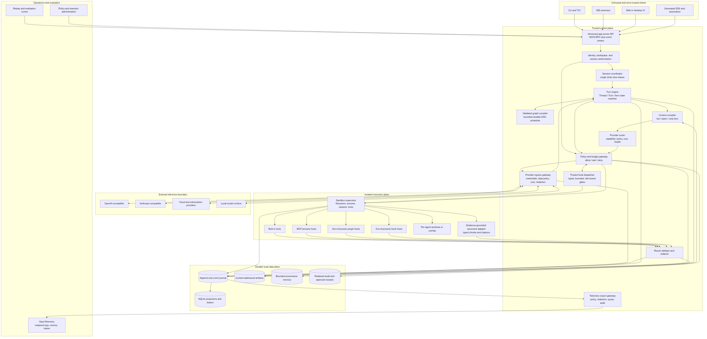
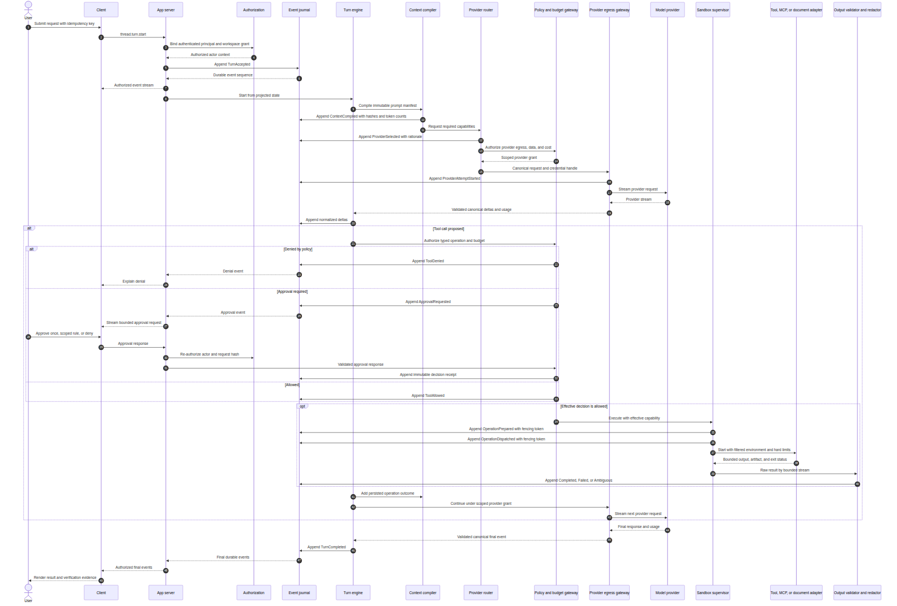
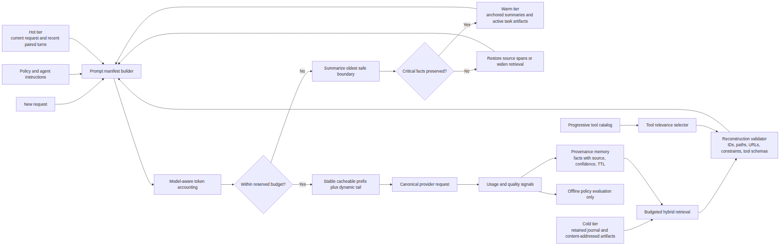
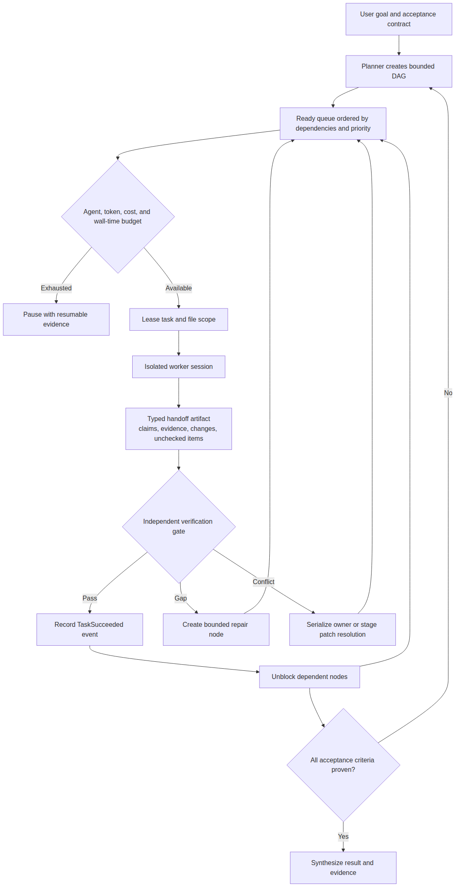
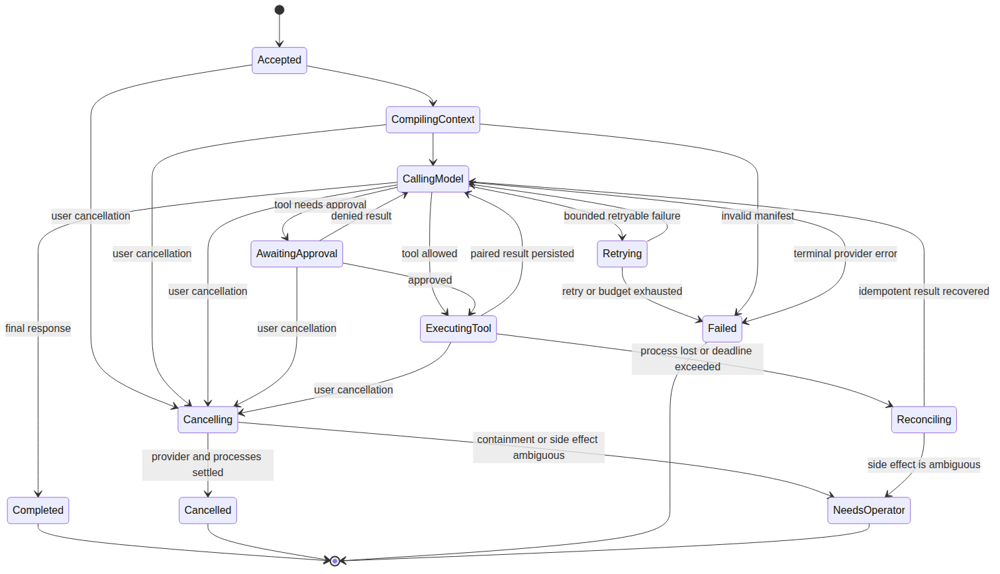
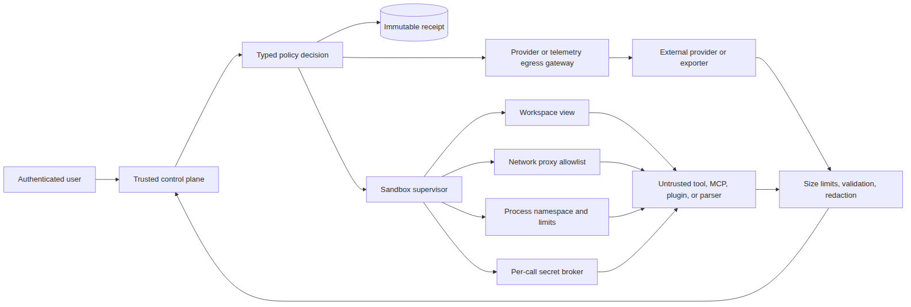

# Atlas Harness: Mermaid architecture and data flow

Status: proposed architecture, researched on 2026-07-25.

This document is the visual contract for a local-first, multi-provider,
multi-agent coding harness. The working name is **Atlas Harness**. It uses the
Apache-2.0 Codex Rust core and app-server protocol as its starting point, then
adds independently reviewed patterns from OpenCode, Jcode, and the locally
audited Orqen and documentIntelligence trees. Claude Code informs independently
specified behavior. The two local trees have no visible license grant, so they
are architectural evidence only until ownership and licensing are resolved.

The companion documents are:

- [End-to-end implementation plan](02-end-to-end-implementation-plan.md)
- [Why this is the best base harness](03-why-this-base-harness.md)

Each diagram is embedded as a local PNG so it remains visible in editors and
Markdown previews that do not render Mermaid. The editable Mermaid source is
linked directly below each image.

## Evidence boundary

The diagrams distinguish audited source from proposed design:

- Codex was reviewed at
  [`4c43465`](https://github.com/openai/codex/commit/4c43465133428898aa84f0bfc02c306ed65fb66a).
- OpenCode was reviewed at
  [`7534d23`](https://github.com/anomalyco/opencode/commit/7534d23551f665e65080809975b4ca5c7d63807b).
- Jcode was reviewed at
  [`11cda7d`](https://github.com/1jehuang/jcode/commit/11cda7dcbc4d685589d96a0af26af963be751352).
- Claude Code behavior was reviewed from its official documentation. Its public
  repository is all-rights-reserved, so any similar behavior requires an
  independent implementation and legal review.
- The local `/home/dragon/Documents/Orqen` tree was reviewed read-only on
  2026-07-25. It contains durable graph versions, idempotent runs, worker leases,
  deterministic bounded scheduling, provider adapters, cancellation, recovery,
  and bounded event replay. It does not contain a coding-tool or OS-sandbox
  kernel.
- The local `/home/dragon/Documents/documentIntelligence` tree was reviewed
  read-only on 2026-07-25. It contains a typed agent registry, canonical events,
  bounded tool-loop patterns, checkpoints, artifacts, and evidence-grounded
  corpus retrieval. Its permission helpers are not enforced by the tool loop,
  and pause/resume/interrupt remain planned work.
- Neither local tree exposes a `LICENSE`, `COPYING`, or `NOTICE` file or package
  license declaration. Atlas may adapt documented concepts but must not copy
  their source until a license grant or written permission is recorded.

## Architectural invariants

1. Every state transition is a typed, append-only event before it is projected.
2. Every external or privilege-bearing side effect crosses a policy, budget,
   egress, and audit gateway.
3. An approval narrows authority; it never disables the OS sandbox.
4. One session has one active writer. Different sessions may run concurrently.
5. Queues, histories, retries, tool output, agent fan-out, and memory are bounded.
6. Tool-call and tool-result pairs are never separated by compaction.
7. Provider routing is explainable, policy-constrained, and recorded.
8. A client may disconnect without terminating its durable session.
9. Plugins, MCP servers, and document processors are untrusted processes.
10. Recovery replays durable events; it never guesses that a side effect ran.
11. A citation binds an immutable artifact version, checksum, span, retriever
    revision, and tool call; model-authored evidence text is not provenance.

## 1. System architecture

[Mermaid source](diagrams/01-system-architecture.mmd)

### Ownership

| Component | Owns | Must not own |
| --- | --- | --- |
| App server | Protocol validation, authentication, event subscriptions | Model prompts or direct tool execution |
| Session coordinator | Writer lease, cancellation, reconnect, backpressure | Business policy |
| Turn engine | Deterministic turn state and event emission | Provider credentials or host shell |
| Context compiler | Ordered prompt manifest and token budget | Unbounded transcript copies |
| Provider router | Capability match and recorded route decision | Silent model downgrade |
| Policy gateway | Effective capability, approval, budgets, receipts | Unsandboxed execution |
| Egress gateway | Provider credentials, data policy, redaction, and cost | Model selection |
| Sandbox supervisor | OS isolation and resource enforcement | User-facing policy decisions |
| Result filter | Output validation, redaction, and artifact limits | Tool authorization |
| Event journal | Durable facts in aggregate sequence order | Mutable derived views |
| Projections | Queryable current state | Source-of-truth mutations |
| Task scheduler | Validated graph, leases, bounded waves, checkpoints, typed handoffs | Direct file writes |
| Document adapter | Authorized retrieval, immutable provenance, citation validation | Model authority or host parser execution |

## 2. One complete turn

[Mermaid source](diagrams/02-complete-turn.mmd)

The journal makes control-state replay, reconnect, and audit deterministic. It
cannot make an arbitrary external side effect exactly once. Automatic recovery
requires a tool-supported idempotency key or status reconciliation; otherwise a
dispatched but unconfirmed operation becomes `NeedsOperator` and is never
silently retried.

## 3. Context and memory data flow

[Mermaid source](diagrams/03-context-memory-flow.mmd)

Context is an immutable manifest of source references, not one repeatedly copied
string. The compiler reserves output and tool-result capacity before adding
history. Memory retrieval has a result count, byte limit, deadline, and
one-turn-late fallback so it cannot stall the interactive path.

## 4. Multi-agent task DAG

[Mermaid source](diagrams/04-multi-agent-dag.mmd)

Messages are for coordination; the DAG and artifacts are authoritative. A task
has one owner, explicit dependencies, a maximum depth and fan-out, and declared
file leases or isolated overlays. A worker cannot broaden its own authority.

## 5. Turn and recovery state machine

[Mermaid source](diagrams/05-turn-recovery-state.mmd)

Terminal states are explicit. An ambiguous external side effect cannot be
silently retried, and cancellation waits for owned subprocess cleanup or records
an operator-visible containment failure.

## 6. Security trust boundaries

[Mermaid source](diagrams/06-security-boundaries.mmd)

The policy decision and the sandbox are independent controls. The control plane
passes opaque secret handles where possible, filters environment variables, and
never exposes all daemon credentials to an extension process. Provider and
telemetry egress apply destination, data, cost, redaction, and audit policy.

## Design lineage

| Proposed capability | Evidence used | Treatment |
| --- | --- | --- |
| Thread/Turn/Item protocol, app server, sandbox, exec policy | Codex app-server, Linux sandbox, and exec-policy source | Base and extend |
| Canonical provider layer, durable event journal, generated SDK, rich MCP | OpenCode source | Adapt behind Codex-compatible contracts |
| Detached multi-client daemon, compaction boundaries, typed task DAG | Jcode source | Adapt with stricter bounds and isolation |
| Hooks, scoped subagents, checkpoints, worktrees, deferred tool discovery | Claude Code official docs | Independent implementation subject to legal review |
| Graph versions, run leases, deterministic waves, checkpoints, provider adapters | Local Orqen source | Adapt contracts after license clearance; never use it as the coding sandbox |
| Canonical events, bounded tool loop, artifact lifecycle, evidence ledger, grounded finish | Local documentIntelligence source | Adapt contracts after license clearance; harden auth, persistence, parsing, and citations |
| Tool recall, reconstruction validation, fail-open optional optimization | Public Orqen claims plus local gap analysis | Treat as measurable optimization; execution security remains fail-closed |

## Primary sources

- [Codex repository and Apache-2.0 license](https://github.com/openai/codex/tree/4c43465133428898aa84f0bfc02c306ed65fb66a)
- [Codex app-server protocol](https://github.com/openai/codex/blob/4c43465133428898aa84f0bfc02c306ed65fb66a/codex-rs/app-server/README.md)
- [Codex Linux sandbox](https://github.com/openai/codex/blob/4c43465133428898aa84f0bfc02c306ed65fb66a/codex-rs/linux-sandbox/README.md)
- [Codex executable policy](https://github.com/openai/codex/blob/4c43465133428898aa84f0bfc02c306ed65fb66a/codex-rs/execpolicy/README.md)
- [OpenCode durable event implementation](https://github.com/anomalyco/opencode/blob/7534d23551f665e65080809975b4ca5c7d63807b/packages/core/src/event.ts)
- [OpenCode provider-independent LLM package](https://github.com/anomalyco/opencode/tree/7534d23551f665e65080809975b4ca5c7d63807b/packages/llm)
- [Jcode server architecture](https://github.com/1jehuang/jcode/blob/11cda7dcbc4d685589d96a0af26af963be751352/docs/SERVER_ARCHITECTURE.md)
- [Jcode task DAG](https://github.com/1jehuang/jcode/blob/11cda7dcbc4d685589d96a0af26af963be751352/docs/SWARM_TASK_GRAPH.md)
- [Claude Code architecture](https://code.claude.com/docs/en/how-claude-code-works)
- [Claude Code sandboxing](https://code.claude.com/docs/en/sandboxing)
- [Public Orqen product page](https://www.orqen.app/)
- [Local Orqen graph schema](../../../Orqen/server/app/features/agent_graphs/graph/schemas.py)
- [Local Orqen durable scheduler](../../../Orqen/server/app/features/agent_graphs/runtime/multi_agent_scheduler.py)
- [Local documentIntelligence runtime definition](../../../documentIntelligence/server/app/services/agents/runtime/definition.py)
- [Local documentIntelligence grounded finish validation](../../../documentIntelligence/server/app/services/agents/definitions/corpus_search/finish_validation.py)
